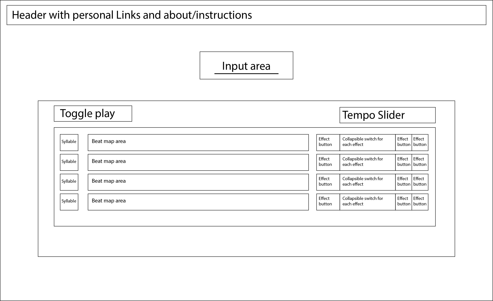

# LexiLoop
## Background and overview
LexiLoop is a combination beat looper and user-inputted vocoder with potential dictionary add-ons. 
A user will type in a word (and potentially a short phrase). The browser's built in text-to-speech 
processer, with some dictionary parsing, will split the word into one syllable per track. After the 
user clicks a few squares to place 'notes', they can click play and Lexiloop will begin a beat loop 
using the syllables from the inputted text. The user will then be able to play with sliders and 
buttons to control the tempo and pitch, among other possibilities. 

The possibilities are endless for the add-ons that could be modularly added such as: more effects 
like reverb or panning, background soundscapes/atmosphere, or the ability to fetch a random word. 

## Functionality and MVPs
In LexiLoop, users will be able to:
[ ] Type in a correctly spelled word
[ ] Input a pattern of looping beats with their inputted text syllabified - (is it possible to somehow syllabify the text-to-speech?)
[ ] Play/pause the loop
[ ] Affect the global tempo of the loop
[ ] Affect the quality of each syllable using pitch, panning, etc. 
[ ] Clear the loop and start over

In addition, this project will include:

[ ] An 'About' explaining how the app works. 

## Wireframe & file structure
### Wireframe

### File structure
/design_docs
/src
  - /assets 
    - empty for right now. 
  - index.js
  - /scripts
    - header.js
    - track.js
    - dictionary.js
    
  - /styles
    - index.scss
    - _reset.scss
.gitignore
index.html
package.json
README.md
webpack.common.js
webpack.dev.js
webpack.prod.js

## Architecture and technology
- Scss
- HTML
- Javascript
- Js web speech api 
- Js web audio api
- MERRIAM-WEBSTER'S COLLEGIATE® DICTIONARY WITH AUDIO API 

## Implementation timeline
- Research APIs ~ 0.5 days
- Setup visuals ~ 1.5 days
- Connect user input to audio - 1 day
- Be able to manipulate audio using the UI - 2 days

## Bonus features
- Audio panning 
- Word of the day / random word
- Reverb
- Background soundscapes / atmosphere